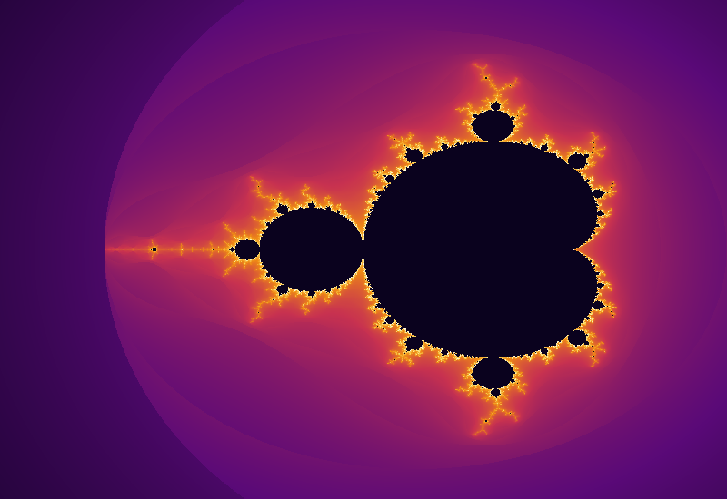
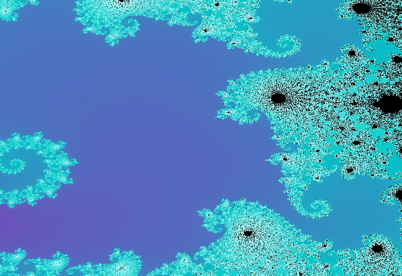

# 🔬 Mandelbrot Explorer


An interactive Python application for exploring the Mandelbrot set fractal. Features a professional dark GUI, real-time zoom and pan, smooth colouring, a bifurcation diagram viewer, and a built-in mathematical theory reference — built to be both a visual tool and an educational companion.

---

## 📸 Screenshots

**Full view — Cosmic Inferno palette**



**Deep zoom into the Seahorse Valley — Neon palette (~800×)**



---

## ✨ Features

- **Interactive zoom** centred on the mouse cursor, supporting depths up to ~10⁸×
- **Pan** by click-and-drag, with live coordinate readout in the status bar
- **5 colour palettes**: Cosmic Inferno, Ocean, Fire, Classic, Neon
- **Smooth (continuous) colouring** — eliminates harsh iteration bands using the double-logarithm formula
- **Progressive rendering** — instant low-resolution preview followed by a full-quality render on a background thread
- **Bifurcation diagram** — interactive period-doubling diagram showing the route to chaos along the real axis
- **Mathematical Theory panel** — 10-section in-app reference covering the iteration, chaos theory, the Feigenbaum constant, Julia sets, and historical milestones
- **Screenshot export** — save PNG or JPEG at full canvas resolution
- **Professional dark theme** throughout

---

## 🚀 Installation

**Requirements:** Python 3.11 or later.

```bash
# Clone the repository
git clone https://github.com/your-username/mandelbrot-explorer.git
cd mandelbrot-explorer

# Install dependencies
pip install PyQt6 numpy matplotlib
```

> `matplotlib` is required only for the Bifurcation Diagram feature.
> The core explorer works with just `PyQt6` and `numpy`.

---

## ▶️ Running

```bash
cd mandelbrot_viewer
python main.py
```

---

## 🎮 Controls

| Action | Effect |
|---|---|
| **Scroll wheel** | Zoom in / out, centred on cursor |
| **Click + drag** | Pan the view |
| **↺ Reset View** | Return to the initial full view |
| **🔍+ / 🔍−** | Zoom in / out from the centre |
| **📐 Mathematical Theory** | Open the in-app theory reference |
| **📊 Bifurcation Diagram** | Show the period-doubling diagram |
| **📷 Save Screenshot** | Export current view as PNG or JPEG |

---

## 🗂️ Project Structure

```
mandelbrot_viewer/
├── main.py                  ← Entry point
├── fractal/
│   ├── mandelbrot.py        ← Core engine: NumPy-vectorised iteration
│   └── coloring.py          ← Smooth colouring + LUT palettes
├── rendering/
│   └── renderer.py          ← NumPy array → QImage conversion
├── gui/
│   └── viewer_window.py     ← Full PyQt6 GUI, dialogs, bifurcation chart
└── utils/
    └── viewport.py          ← Coordinate transforms, zoom/pan logic
```

---

## 🧮 Mathematics

### The Iteration

The Mandelbrot set is the set of all complex numbers **c** for which the sequence:

```
z₀ = 0
z_{n+1} = z_n² + c
```

remains bounded. In practice, once `|z_n| > 2` the orbit is guaranteed to diverge — this is the **escape radius**.

### Smooth Colouring

Naive integer iteration counts produce harsh colour bands. This application uses the **smooth iteration count** formula:

```
ν = n − log₂( log₂( |z_n| ) )
```

Since the orbit magnitude grows roughly as `|z| ≈ Rⁿ`, the double logarithm removes the discrete jumps and produces a seamless, continuous gradient.

### Chaos and the Fractal Boundary

The Mandelbrot set is deeply connected to **chaos theory**. Take two points **c** and **c′** separated by an arbitrarily small distance ε, one just inside the boundary and one just outside: their orbits diverge completely. This *sensitive dependence on initial conditions* is the defining property of chaos — and the infinitely jagged boundary is its inevitable geometric consequence. If the boundary were smooth, behaviour would change predictably with distance; because the system is chaotic, no smooth boundary is possible at any scale.

The **bifurcation diagram** (available via the toolbar button) shows this transition explicitly: as **c** moves along the real axis, stable orbits undergo period-doubling `1 → 2 → 4 → 8 → … → chaos`, governed by the universal **Feigenbaum constant δ ≈ 4.669**.

---

## 🎨 Colour Palettes

| Name | Description |
|---|---|
| **Cosmic Inferno** | Deep violet → orange → white; dramatic and high-contrast |
| **Ocean** | Black → navy → cyan → pale blue; calm and deep |
| **Fire** | Black → red → orange → yellow; intense heat gradient |
| **Classic** | Navy → sky blue → white; close to the traditional rendering |
| **Neon** | Black → green → magenta → cyan; vivid cyberpunk feel |

---

## 🔭 Suggested Exploration Targets

| Location | Real range | Imaginary range | Notes |
|---|---|---|---|
| Full view | [−2.5, 1.0] | [−1.5, 1.5] | Starting point |
| Seahorse Valley | [−0.745, −0.741] | [0.110, 0.114] | Spiral tendrils |
| Lightning bolts | [−0.570, −0.560] | [−0.640, −0.630] | Filament detail |
| Baby Mandelbrot | [−1.780, −1.760] | [−0.010, 0.010] | Miniature copy of the full set |
| Deep spiral | [−0.7269, −0.7266] | [0.1889, 0.1892] | ~5000× zoom |

---

## 🛠️ Architecture Notes

- **Rendering is always off the main thread.** A `QThread` worker handles the NumPy computation so the GUI never blocks.
- **Progressive rendering:** a 25%-scale preview is shown immediately, then the full render replaces it when ready.
- **Viewport transforms** are handled by a dedicated `Viewport` class that maps pixel coordinates to the complex plane with full floating-point precision.
- **LUT-based colouring:** each palette is pre-computed into a 2048-entry RGB look-up table for fast per-pixel mapping.

---

## 🔮 Possible Extensions

- Julia set viewer (companion fractal for each point c)
- Orbit tracing — animate the path of z_n for a chosen c
- Arbitrary-precision arithmetic for zoom depths beyond 10¹⁴
- Custom palette editor
- Cinematic zoom recording (video export)
- High-resolution batch export

---

## 📄 License

This project is released under the [MIT License](LICENSE).

---

## 🤖 Development Methodology — Vibe Coding with Claude Sonnet 4.6

This project was developed entirely through **Vibe Coding** — a methodology in which the developer guides an AI model using natural language, iterative feedback, and conversational refinement, without writing source code manually.

The entire codebase — architecture, all Python modules, the PyQt6 GUI, the NumPy rendering engine, the mathematical theory content, and this README — was generated by **Claude Sonnet 4.6** (Anthropic), the latest model in the Claude 4.6 family, in a single iterative conversation session.

The development workflow proceeded as follows:

1. **A requirements document** (PDF) was provided as the starting specification.
2. **Claude generated the full project structure** — five modules across four packages — from scratch in one pass.
3. **Bugs and UX issues** (broken imports, Italian text in an English UI, HTML entities appearing literally in buttons, a missing `matplotlib` dependency) were reported conversationally and fixed immediately in the relevant files.
4. **New features** (the Mathematical Theory dialog, the Chaos Theory sections, the Bifurcation Diagram) were requested in plain language and integrated into the existing codebase without regression.
5. **This README**, including the two rendered fractal screenshots, was generated programmatically within the same session.

Vibe Coding does not mean the developer is passive. It requires a clear vision of the desired outcome, the ability to evaluate generated code critically, precise bug reporting, and iterative steering. The AI acts as an expert pair-programmer; the human acts as architect, QA engineer, and product owner simultaneously.

> *"The best way to predict the future is to invent it — even if you ask an AI to write the code."*

---

<p align="center">
  Built with ❤️ and Claude Sonnet 4.6 &nbsp;·&nbsp; Explore the infinite boundary between order and chaos
</p>
